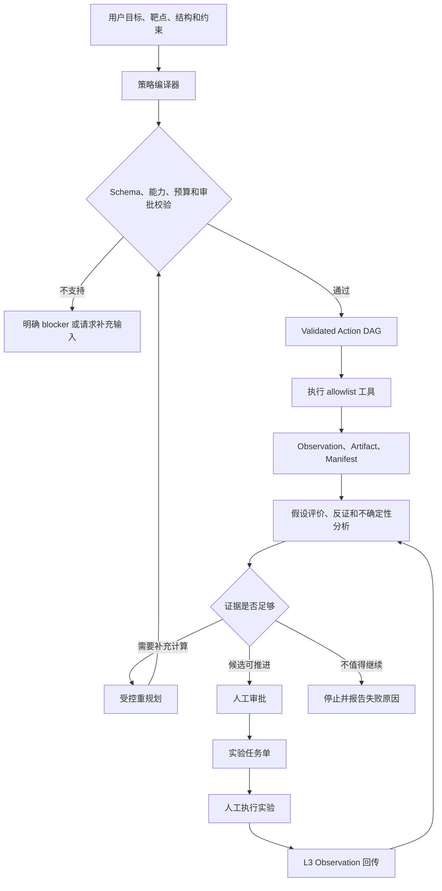
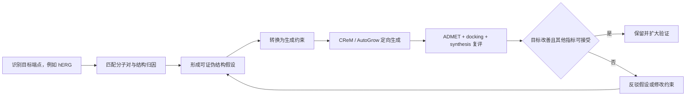

# 基于 Biomni 的小分子药物设计 Agent 优化方向报告

## 1. 报告目的

本报告参考 Science 论文《Autonomous biomedical research with an artificial
intelligence agent》及其公开前身《Biomni: A General-Purpose Biomedical AI
Agent》，结合本项目现有代码，给出从“固定计算流水线”升级为“观察驱动、可审计、
有人类决策门的药物设计闭环”的实施方向。

参考资料：

- Science 正式论文：<https://doi.org/10.1126/science.adz4351>
- Biomni 公开预印本：<https://doi.org/10.1101/2025.05.30.656746>
- Biomni 官方实现：<https://github.com/snap-stanford/Biomni>
- 本项目论文核对笔记：
  `docs/research/autonomous-biomedical-research-paper-notes.md`

## 2. 执行摘要

本项目已经具备 P2Rank、CReM、TargetDiff、AutoGrow4、Vina、GNINA、ADMET-AI、
AiZynthFinder、证据等级、执行 manifest 和人工确认等基础能力。近期瓶颈不是专业工具
数量，而是策略字段、工具请求、中间观察和下一轮决策之间没有形成严格的数据合同。

建议按以下顺序优化：

1. P0：保证用户输入和策略约束完整持久化，并真正传到执行器。
2. P0：建立 `Hypothesis -> Action -> Observation -> Evaluation` 数据闭环。
3. P1：将现有工具注册为有 schema、预算、证据上限和失败策略的 Action Registry。
4. P1：在 allowlist 和审批边界内，根据 observation 动态重规划。
5. P2：打通“实验任务单导出 -> 人工实验 -> L3 结果回传”。
6. P2：建立科学正确性、校准、成本和可复现性的端到端基准。

本次已处理两个基础一致性问题：

- 仅输入自定义靶点名称时，系统创建并持久化 `Target`，生成非空 `target_id`，同时在
  `Project` 中保留 `target_name`，避免后续结构准备失去靶点上下文。
- 轮次改为“初排 -> 自我反驳 -> 最终重排”，报告、审计和返回结果使用吸收本轮
  critique 后的最终排名。

## 3. Biomni 最值得借鉴的机制

Biomni 的贡献包含大规模工具集成，但对本项目最有价值的是工具上层的四种机制：

1. 动作检索：只选择与当前任务相关的工具、数据库和程序性知识。
2. 可执行计划：计划不是文字清单，而是可以校验、执行和追踪的动作序列。
3. 观察驱动重规划：每个工具执行后读取 observation，再决定继续、重试、换工具或停止。
4. 环境接地：结论必须回指真实工具输出、数据库记录或实验结果。

不建议直接复制 Biomni 的任意代码执行模式。本项目涉及 GPU 工具、外部数据、潜在敏感
结构和高成本任务，应继续使用 allowlist、固定运行环境、资源预算和人工审批。

## 4. 当前系统基线与缺口

### 4.1 已有优势

- `RoundStrategyAgent` 生成下一轮策略并要求用户确认。
- `RoundOrchestrator` 已串联生成、评价、排名、自我反驳和报告。
- `scientific_execution.py` 区分 L0/L1/L2/L3 证据等级。
- capability snapshot、workflow packet、manifest、哈希和工具版本支持审计。
- `Critique`、`ReasoningTrace` 和 `DecisionCard` 能保存正反证据和决策理由。
- GNINA 1.3.2 CUDA 12.8 下载地址已固定在 WSL 工具安装脚本中；二进制属于运行时
  依赖，不应提交到 Git 仓库。

### 4.2 关键缺口

| 缺口 | 当前影响 | 目标状态 |
|---|---|---|
| 策略与执行脱节 | 部分 `property_constraints` 只被记录 | 每个字段映射到工具参数、过滤、排名或 blocker |
| 下一轮输入过于摘要化 | Planner 看不到逐分子结构变化和失败原因 | 输入匹配分子对、端点变化、失败分类和 Pareto 前沿 |
| 流程顺序固定 | 中间失败不能自动补充动作 | allowlist 内条件分支、有限重试和动态重规划 |
| 实验 observation 不规范 | 单位、重复、误差、批次和 QC 难以审计 | 结构化 assay 与 observation 模型 |
| 审批未完全阻断执行 | `requires_approval` 可能只停留在记录层 | 执行器在审批事件满足前拒绝进入阶段 |
| SAR 未接入主线 | 结构变化规律不能稳定回流生成 | parent-child 变换和 SAR 约束进入下一轮生成 |

## 5. 推荐目标架构



## 6. P0：建立可靠的数据和执行合同

### 6.1 Strategy Compiler

增加 `Strategy -> Validated Action DAG -> Tool Request` 编译层。策略中的每个字段必须
落入以下类型之一：

- `generation_objective`：直接影响生成或遗传搜索的目标函数。
- `hard_filter`：生成后必须满足的硬约束。
- `ranking_weight`：改变多目标排序权重。
- `report_only`：只展示，不参与决策。
- `unsupported`：当前工具无法实现，预检时返回 blocker。

编译器输出必须保存字段来源、目标 action、实际参数、默认值、覆盖关系和不支持原因。
这样用户选择“降低 hERG”时，系统不能静默退化为只在报告中显示 hERG。

### 6.2 Observation Packet

为每个 parent-child 分子对记录：

- 结构变换和受影响子结构；
- docking 姿态、分数和置信度变化；
- 每个 ADMET 端点的预测值、模型版本和适用域；
- 合成路线是否找到、步数、原料可得性和失败原因；
- 证据等级、运行参数、artifact 和 manifest；
- 该变换支持或反驳了哪个假设。

建议新增四个领域对象：

```text
Hypothesis
  id, project_id, round_id, claim, target_endpoint,
  expected_direction, rationale, status

ExperimentProposal
  id, hypothesis_id, actions, controls, budget,
  success_criteria, falsification_criteria, approval_status

Observation
  id, action_id, molecule_id, endpoint, value, unit,
  conditions, uncertainty, repeats, qc_status, evidence_level, provenance

HypothesisEvaluation
  id, hypothesis_id, verdict, supporting_observation_ids,
  contradicting_observation_ids, confidence, next_action
```

### 6.3 排名与反驳的一致性

正式轮次采用两阶段排名：

```text
候选评价
  -> 初排：提供候选优先级和 critique 上下文
  -> 自我反驳：产生本轮 Critique
  -> 最终重排：读取最新 Critique
  -> 报告和下一轮策略
```

初排属于中间 observation；只有最终重排可以写入正式报告的最终推荐。审计中应区分
`pre_refutation_ranking` 和 `post_refutation_ranking`，并保存两者差异。

## 7. P1：Action Registry 与动态重规划

### 7.1 Action Registry

为每个专业工具建立统一声明：

| 字段 | 说明 |
|---|---|
| `action_name/version` | 稳定动作名和实现版本 |
| `input_schema/output_schema` | 类型、单位和必填字段 |
| `required_capabilities` | GPU、CUDA、模型、许可证、受体结构等 |
| `evidence_ceiling` | 该动作最多产生 L0/L1/L2/L3 中哪一级证据 |
| `budget` | 时间、GPU、候选数量、磁盘和 API 成本 |
| `retry_policy` | 可恢复错误、最大次数和参数变化范围 |
| `artifacts` | 输出文件、日志、哈希和保留策略 |
| `validation` | 金标准样例和输出合理性检查 |

首批注册现有 P2Rank、CReM、TargetDiff、AutoGrow4、Vina、GNINA、ADMET-AI 和
AiZynthFinder，不以工具数量为目标。

### 7.2 允许的动态分支

- P2Rank 口袋不可用：阻断结构生成和 docking，要求选择其他口袋或上传更合适结构。
- Vina 与 GNINA 结果严重不一致：补跑姿态检查，不直接进入正式排名。
- 同一 scaffold 普遍出现 hERG 风险：提出降低碱性/脂溶性的假设并分配验证预算。
- AiZynthFinder 找不到路线：在保留关键相互作用的前提下启动可合成性导向生成。
- ADMET 模型超出适用域：降低证据置信度，不能把预测值作为硬淘汰的唯一依据。

每个动态分支必须有最大重试次数、预算上限、停止条件和 manifest。LLM 不得绕过 registry
直接执行任意 Shell 命令。

## 8. P1：将 ADMET 从筛选升级为生成反馈

推荐的单端点优化闭环如下：



必须保留多目标约束，避免只优化一个预测指标导致 potency、选择性、溶解度或可合成性
明显恶化。最终选择使用 Pareto 前沿，并在报告中展示每个候选相对母体的端点变化。

## 9. P2：人类实验闭环

先实现实验任务单导出和结果导入，不直接控制实验机器人。任务单至少包含：

- 化合物、批次、纯度和结构标识；
- assay 端点、单位、浓度梯度和重复数；
- 阳性/阴性对照和验收标准；
- 安全说明、实验条件和偏差处理；
- 与 `Hypothesis`、候选排名和计算证据的关联。

结果导入时校验单位、重复、误差、批次、对照和 QC。只有通过 QC 的实验结果才标记为
L3 Observation，并触发假设评价和下一轮策略草稿。

## 10. 审批与安全边界

以下动作必须有强制审批门：

- 高成本 GPU 批处理或超过项目预算；
- 将结构或数据发送到外部 API；
- 正式淘汰候选或提交实验；
- 修改项目主目标、硬约束或证据门槛；
- 执行 registry 之外的代码或工具。

审批不是报告字段。执行器必须查询审批事件，在审批未满足时保持 `blocked` 或 `queued`，
并在 workflow packet 中保存审批人、时间、批准范围和对应计划哈希。

## 11. 端到端基准与验收指标

建议建立冻结的 BRAF、EGFR 等任务包，对比固定流水线和动态闭环：

| 维度 | 指标示例 |
|---|---|
| 科学正确性 | 已知活性/非活性盲测、已知 SAR 恢复、结构诱饵识别 |
| 多目标决策 | Pareto 命中率、单端点改善时其他端点退化比例 |
| 可合成性 | 路线命中、步骤数、可购买原料比例、人工化学家接受率 |
| 校准 | 预测置信度与实际错误率是否匹配 |
| 可复现性 | 相同快照和随机种子能否复现候选、排名和 artifact |
| 可靠性 | 工具缺失、超时和坏输出时是否正确阻断或降级 |
| 效率 | GPU 小时、API 成本、人工审核时间和每个有效候选成本 |

至少进行以下消融：无动态重规划、无程序性 RAG、无自我反驳、无实验 observation、
无 ADMET 生成反馈。评价对象应是科学结果和过程可靠性，而不是 LLM 文本流畅度。

## 12. 建议实施里程碑

### M1：执行合同可验证

- 自定义靶点、结构选择和全部策略字段可持久化。
- Strategy Compiler 能指出每个字段的执行去向。
- critique 后最终重排成为正式排名。
- 验收：不存在“UI 已选择但执行请求中丢失”的字段。

### M2：计算 observation 闭环

- 建立 Hypothesis、Observation、Evaluation 和 parent-child 变换模型。
- 下一轮读取逐分子变化、失败原因和 Pareto 前沿。
- 验收：报告能解释候选相对母体为何上升或下降。

### M3：受控动态规划

- 完成首批 Action Registry。
- 支持有限条件分支、重试、预算和审批阻断。
- 验收：冻结故障场景中，系统能正确重试、换动作或停止，不静默降级。

### M4：实验反馈

- 标准化实验任务单和结果导入。
- L3 observation 触发假设评价和下一轮建议。
- 验收：每条实验结论可追溯到原始结果、单位、条件、QC 和项目决策。

## 13. 总体判断

本项目不需要演变成无边界的通用生物医学智能体。应保留领域专用工具链、证据等级、
运行时隔离和人工决策权，引入 Biomni 的动作检索、可执行计划、观察驱动重规划和系统化
基准。近期最高价值工作是让策略完整进入执行，并让逐分子 observation 真正决定下一轮；
这两项完成前，继续增加模型和工具只会扩大流水线，不会形成更强的科研闭环。
